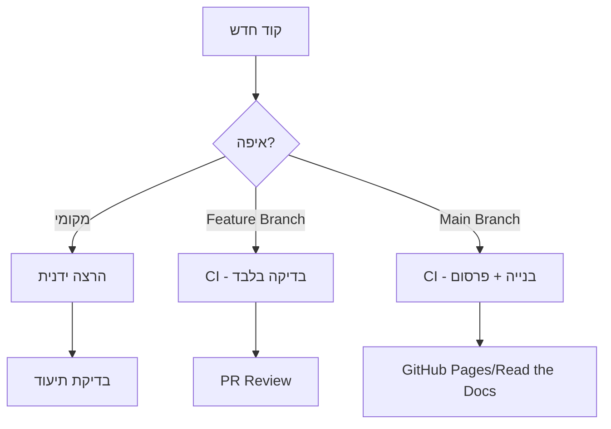
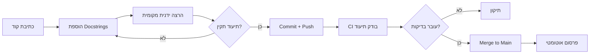

# 📖 מדריך תיעוד - Code Keeper Bot

## 🎯 סקירה כללית

מדריך זה מכיל את כל ההמלצות וההגדרות לניהול התיעוד של הפרויקט בצורה אופטימלית.

## 🤖 הרצה אוטומטית vs ידנית

### 📊 טבלת השוואה

| קריטריון | הרצה ידנית | הרצה אוטומטית |
|---------|------------|----------------|
| **מתי להשתמש** | פיתוח מקומי | Production |
| **תדירות** | לפי דרישה | בכל push/merge |
| **משאבים** | מקומיים | CI/CD |
| **זמן תגובה** | מיידי | 2-5 דקות |
| **עקביות** | תלוי במפתח | מובטחת |
| **פרסום** | ידני | אוטומטי |

### 🎯 המלצה: גישה משולבת



## 🔧 הגדרות להרצה ידנית

### 1. סקריפט מקומי מהיר
```bash
#!/bin/bash
# build_docs_local.sh

echo "🔨 Building documentation locally..."

# בדיקת תלויות
if ! command -v sphinx-build &> /dev/null; then
    echo "📦 Installing Sphinx..."
    pip install sphinx sphinx-rtd-theme sphinx-autodoc-typehints sphinxcontrib-napoleon
fi

# בניית תיעוד
cd docs
make clean
make html

# פתיחה בדפדפן (אופציונלי)
if [[ "$OSTYPE" == "darwin"* ]]; then
    open _build/html/index.html
elif [[ "$OSTYPE" == "linux-gnu"* ]]; then
    xdg-open _build/html/index.html
fi

echo "✅ Documentation ready at docs/_build/html/index.html"
```

### 2. Pre-commit Hook
```bash
# .git/hooks/pre-commit
#!/bin/bash

echo "📖 Checking documentation..."

# בדיקת docstrings
python -m pydocstyle --count

# בניית תיעוד לבדיקה
cd docs && make html > /dev/null 2>&1
if [ $? -ne 0 ]; then
    echo "❌ Documentation build failed!"
    exit 1
fi

echo "✅ Documentation check passed"
```

## 🚀 הגדרות להרצה אוטומטית

### 1. GitHub Actions - בנייה ופרסום
```yaml
# .github/workflows/documentation.yml
name: Documentation

on:
  push:
    branches: [main, develop]
    paths:
      - '**.py'
      - 'docs/**'
      - 'requirements.txt'
  pull_request:
    branches: [main]
    paths:
      - '**.py'
      - 'docs/**'
  release:
    types: [published]
  workflow_dispatch:

jobs:
  build-docs:
    runs-on: ubuntu-latest
    
    steps:
    - name: 📥 Checkout code
      uses: actions/checkout@v3
      with:
        fetch-depth: 0  # Full history for git info
    
    - name: 🐍 Setup Python
      uses: actions/setup-python@v4
      with:
        python-version: '3.9'
        cache: 'pip'
    
    - name: 📦 Install dependencies
      run: |
        pip install --upgrade pip
        pip install sphinx sphinx-rtd-theme sphinx-autodoc-typehints sphinxcontrib-napoleon
        # Install project dependencies for autodoc
        pip install -r requirements.txt || true
    
    - name: 🔨 Build documentation
      run: |
        cd docs
        sphinx-build -b html . _build/html -W --keep-going
      env:
        SPHINX_MOCK_IMPORTS: true
    
    - name: 📊 Generate coverage report
      if: github.event_name == 'pull_request'
      run: |
        cd docs
        sphinx-build -b coverage . _build/coverage
        cat _build/coverage/python.txt
    
    - name: 💾 Upload artifacts
      uses: actions/upload-artifact@v3
      with:
        name: documentation
        path: docs/_build/html/
        retention-days: 7
    
    - name: 🌐 Deploy to GitHub Pages
      if: github.ref == 'refs/heads/main' && github.event_name == 'push'
      uses: peaceiris/actions-gh-pages@v3
      with:
        github_token: ${{ secrets.GITHUB_TOKEN }}
        publish_dir: ./docs/_build/html
        cname: docs.your-domain.com  # אופציונלי
        force_orphan: true
    
    - name: 💬 Comment on PR
      if: github.event_name == 'pull_request'
      uses: actions/github-script@v6
      with:
        script: |
          github.rest.issues.createComment({
            issue_number: context.issue.number,
            owner: context.repo.owner,
            repo: context.repo.repo,
            body: '📖 Documentation preview is ready! Check the artifacts.'
          })
```

### 2. Read the Docs - הגדרות
```yaml
# .readthedocs.yml
version: 2

sphinx:
  configuration: docs/conf.py
  fail_on_warning: true

formats:
  - pdf
  - epub
  - htmlzip

python:
  version: "3.9"
  install:
    - requirements: requirements.txt
    - requirements: docs/requirements.txt
    - method: pip
      path: .

build:
  os: ubuntu-22.04
  tools:
    python: "3.9"
  jobs:
    pre_build:
      - echo "Running pre-build commands"
      - python --version
    post_build:
      - echo "Build complete!"
```

### 3. GitLab CI - הגדרות
```yaml
# .gitlab-ci.yml
stages:
  - test
  - build
  - deploy

variables:
  PIP_CACHE_DIR: "$CI_PROJECT_DIR/.cache/pip"

cache:
  paths:
    - .cache/pip
    - docs/_build

test-docs:
  stage: test
  image: python:3.9
  script:
    - pip install sphinx sphinx-rtd-theme
    - cd docs
    - sphinx-build -b html . _build/html -W
  except:
    - tags

build-docs:
  stage: build
  image: python:3.9
  script:
    - pip install -r requirements.txt
    - cd docs
    - make clean
    - make html
  artifacts:
    paths:
      - docs/_build/html
    expire_in: 1 week
  only:
    - main
    - develop

pages:
  stage: deploy
  dependencies:
    - build-docs
  script:
    - mkdir -p public
    - cp -r docs/_build/html/* public/
  artifacts:
    paths:
      - public
  only:
    - main
```

## 📝 Best Practices

### 1. Docstring Standards
```python
def example_function(param1: str, param2: int = 10) -> dict:
    """
    תיאור קצר ותמציתי של הפונקציה.
    
    תיאור מפורט יותר שמסביר את הלוגיקה,
    השימושים והמגבלות של הפונקציה.
    
    Args:
        param1: תיאור הפרמטר הראשון
        param2: תיאור הפרמטר השני. ברירת מחדל: 10
    
    Returns:
        dict: מילון עם המפתחות הבאים:
            - 'status': סטטוס הפעולה
            - 'data': הנתונים שחזרו
    
    Raises:
        ValueError: אם param1 ריק
        TypeError: אם param2 אינו מספר
    
    Example:
        >>> result = example_function("test", 20)
        >>> print(result['status'])
        'success'
    
    Note:
        פונקציה זו דורשת חיבור לאינטרנט
    
    Warning:
        לא לשימוש עם נתונים רגישים
    
    See Also:
        :func:`related_function`: פונקציה קשורה
        :class:`RelatedClass`: מחלקה קשורה
    """
    pass
```

### 2. מבנה תיקיות מומלץ
```
docs/
├── _static/           # קבצים סטטיים (CSS, JS, תמונות)
│   ├── custom.css
│   └── logo.png
├── _templates/        # תבניות מותאמות
│   └── layout.html
├── api/              # תיעוד API אוטומטי
│   ├── index.rst
│   └── modules.rst
├── guides/           # מדריכים
│   ├── quickstart.rst
│   ├── installation.rst
│   └── configuration.rst
├── examples/         # דוגמאות קוד
│   ├── basic.rst
│   └── advanced.rst
├── conf.py           # הגדרות Sphinx
├── index.rst         # דף הבית
├── Makefile          # פקודות בנייה
└── requirements.txt  # תלויות תיעוד
```

### 3. הגדרות Sphinx מומלצות
```python
# docs/conf.py - תוספות מומלצות

# -- Extension configuration -------------------------------------------------

# Napoleon settings
napoleon_google_docstring = True
napoleon_numpy_docstring = True
napoleon_include_init_with_doc = True
napoleon_include_private_with_doc = False
napoleon_include_special_with_doc = True
napoleon_use_admonition_for_examples = True
napoleon_use_admonition_for_notes = True
napoleon_use_admonition_for_references = True
napoleon_use_ivar = False
napoleon_use_param = True
napoleon_use_rtype = True
napoleon_type_aliases = {
    'DataFrame': 'pandas.DataFrame',
    'Series': 'pandas.Series',
    'ndarray': 'numpy.ndarray',
}

# Autodoc settings
autodoc_default_options = {
    'members': True,
    'member-order': 'bysource',
    'special-members': '__init__',
    'undoc-members': True,
    'exclude-members': '__weakref__',
    'show-inheritance': True,
    'inherited-members': True,
    'private-members': False,
}

# Mock imports for CI/CD
autodoc_mock_imports = [
    'telegram',
    'pymongo',
    'redis',
    'github',
    'cairosvg',
    'aiofiles',
    'fuzzywuzzy',
    'aiohttp',
]

# Intersphinx - קישורים לתיעוד חיצוני
intersphinx_mapping = {
    'python': ('https://docs.python.org/3', None),
    'telegram': ('https://docs.python-telegram-bot.org/en/stable/', None),
    'pymongo': ('https://pymongo.readthedocs.io/en/stable/', None),
    'redis': ('https://redis-py.readthedocs.io/en/stable/', None),
}

# Todo extension
todo_include_todos = True
todo_emit_warnings = True

# Coverage settings
coverage_ignore_modules = [
    'tests.*',
    'test_*',
]

coverage_ignore_functions = [
    'main',
    '__main__',
]

coverage_ignore_classes = [
    'Meta',
]

# Linkcheck
linkcheck_ignore = [
    r'http://localhost:\d+/',
    r'https://t.me/.*',
]

linkcheck_timeout = 10
```

## 🔄 תהליך עבודה מומלץ

### Development Workflow


### 📅 לוח זמנים מומלץ
- **יומי**: הרצה ידנית בפיתוח
- **PR**: בדיקה אוטומטית
- **Merge**: בנייה אוטומטית
- **Release**: פרסום גרסה מתויגת
- **שבועי**: בדיקת קישורים שבורים
- **חודשי**: סקירת coverage

## 🚨 טיפול בבעיות נפוצות

### 1. Import Errors בתיעוד
```python
# docs/conf.py
autodoc_mock_imports = ['problematic_module']
```

### 2. תיעוד לא מתעדכן
```bash
# נקה cache
cd docs
make clean
rm -rf _build
make html
```

### 3. GitHub Pages לא מתעדכן
```yaml
# בדוק הגדרות Repository
Settings > Pages > Source: gh-pages branch
```

### 4. Read the Docs נכשל
```yaml
# .readthedocs.yml
python:
  install:
    - requirements: docs/requirements-docs.txt
```

## 📊 מטריקות לניטור

### KPIs לתיעוד
- **Coverage**: > 80% מהפונקציות מתועדות
- **Build Time**: < 5 דקות
- **Broken Links**: 0
- **Warning Count**: < 10
- **Page Load Time**: < 2 שניות

### ניטור אוטומטי
```yaml
# .github/workflows/docs-metrics.yml
name: Documentation Metrics

on:
  schedule:
    - cron: '0 0 * * 0'  # Weekly

jobs:
  metrics:
    runs-on: ubuntu-latest
    steps:
      - uses: actions/checkout@v3
      
      - name: Check documentation coverage
        run: |
          cd docs
          sphinx-build -b coverage . _build/coverage
          python -c "
          with open('_build/coverage/python.txt') as f:
              content = f.read()
              if 'Undocumented' in content:
                  print('⚠️ Found undocumented items!')
                  print(content)
          "
      
      - name: Check for broken links
        run: |
          cd docs
          sphinx-build -b linkcheck . _build/linkcheck
```

## 🎯 Checklist לפני Production

- [ ] כל הפונקציות הציבוריות מתועדות
- [ ] דוגמאות קוד לכל מודול מרכזי
- [ ] מדריך התקנה מלא
- [ ] מדריך תצורה מפורט
- [ ] API Reference מלא
- [ ] תיעוד עובר בנייה ללא אזהרות
- [ ] GitHub Actions מוגדר ועובד
- [ ] GitHub Pages/Read the Docs מוגדר
- [ ] README מקושר לתיעוד
- [ ] Version tags מסונכרנים

## 📚 משאבים נוספים

- [Sphinx Documentation](https://www.sphinx-doc.org/)
- [Read the Docs Tutorial](https://docs.readthedocs.io/en/stable/tutorial/)
- [GitHub Pages Documentation](https://docs.github.com/en/pages)
- [Google Docstring Style Guide](https://google.github.io/styleguide/pyguide.html#38-comments-and-docstrings)
- [NumPy Docstring Style Guide](https://numpydoc.readthedocs.io/en/latest/format.html)

---

📝 **עדכון אחרון**: דצמבר 2024
🔄 **גרסה**: 1.0.0
✍️ **נוצר עבור**: Code Keeper Bot